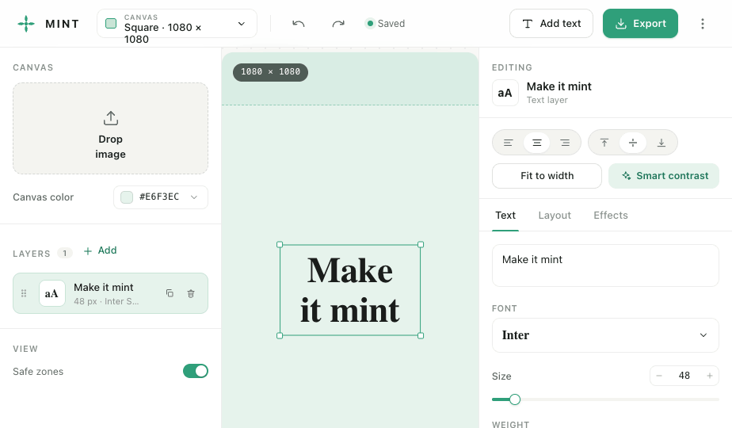
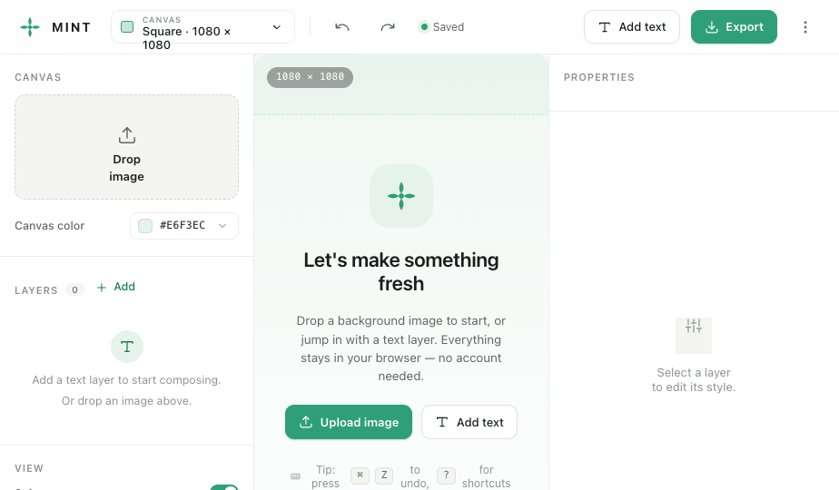
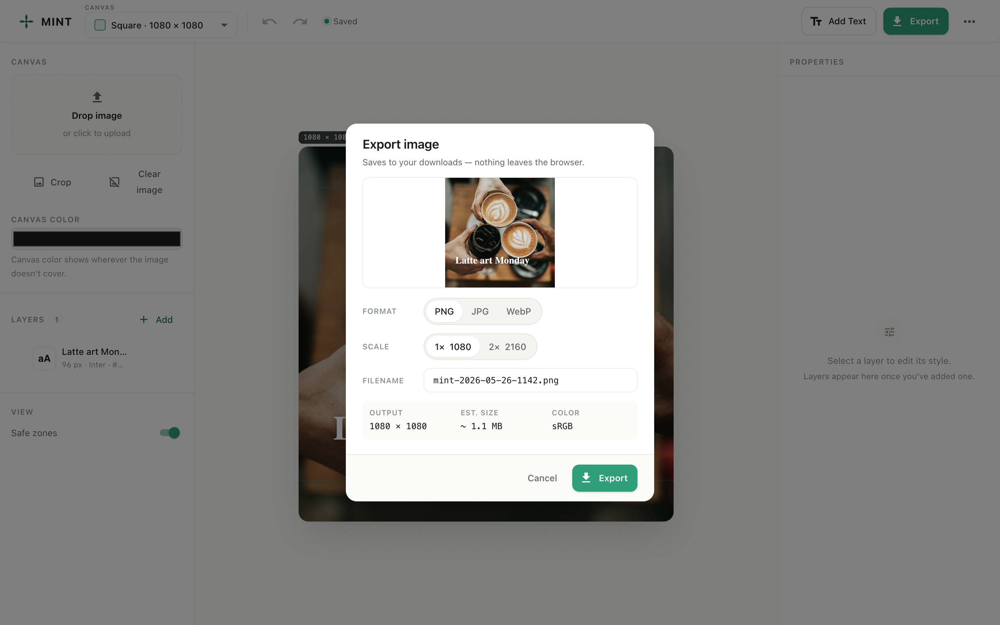
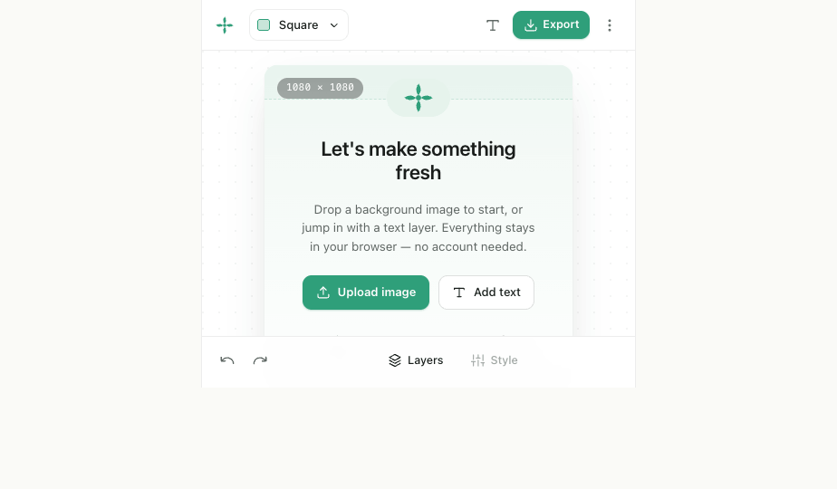
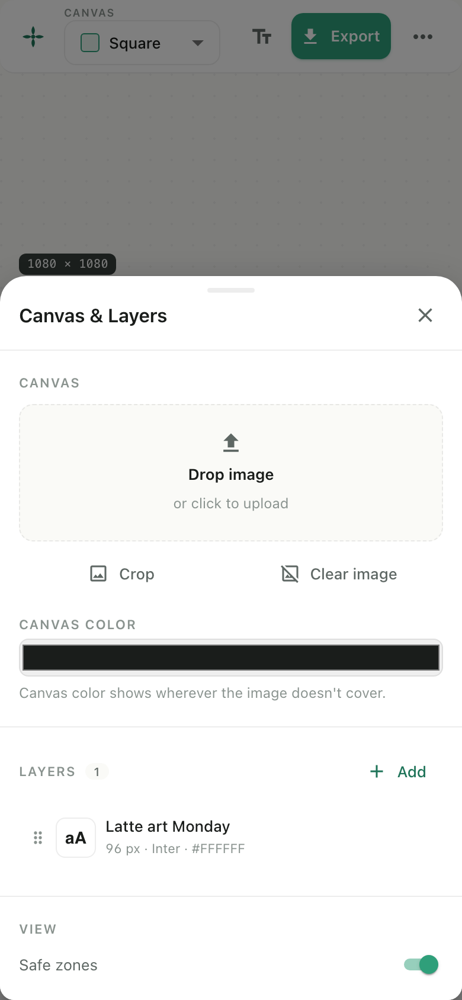
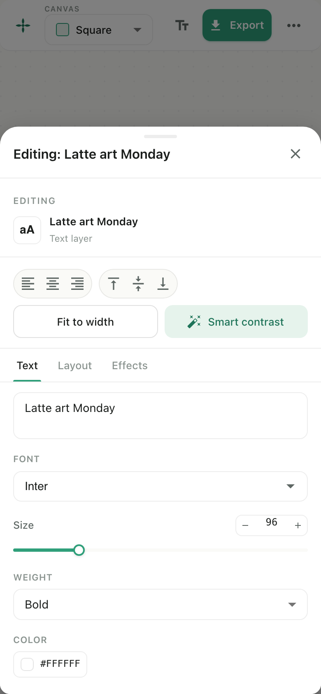

# MINT — социальные картинки прямо в браузере

[English](README.md) | [Русский](README.ru.md)

<p align="center">
  
</p>

<p align="center">
  <strong>Бросил картинку, вписал текст, нажал Экспорт.</strong><br/>
  Делайте красивые посты прямо в браузере — без загрузок в облако, аккаунтов и подписок.
</p>

<p align="center">
  <a href="https://dimagious.github.io/mint/">
    
  </a>
  &nbsp;
  <a href="https://github.com/Dimagious/mint/actions/workflows/ci.yml">
    
  </a>
  &nbsp;
  <a href="./LICENSE">
    
  </a>
</p>

<p align="center">
  
</p>

---

## Зачем это

Я регулярно делаю обложки постов, слайды для сторис и анонсы для пет-проектов. Каждый «лёгкий аналог Canva» хочет мой email, тащит проекты в своё облако и продаёт Pro. Хотелось инструмент, который делает одно — и делает быстро, прямо в браузере, без отвлечений.

**MINT = Merge Image'N Text.** Открыл страницу, бросил фон, вписал заголовок, выгрузил PNG. Это весь продукт. Без аккаунтов, без папок проектов, без AI-подсказок, без маркетплейса шаблонов.

## Что я узнал, делая это

Три инженерных идеи, которые сделали проект интересным:

- **Canvas как состояние, а не как DOM.** [Fabric.js](https://fabricjs.com/) держит визуальное представление, [Zustand](https://github.com/pmndrs/zustand) — источник правды. Между ними прослойка `FabricAdapter`, которая транслирует мутации стора в операции над canvas, а события выделения/перетаскивания обратно в action'ы стора.
- **Дизайн до кода — даже для пета.** В репо есть [`docs/design/BRIEF.md`](./docs/design/BRIEF.md) — настоящий бриф, написанный до редизайна, со скриншотами «до/после», жёсткими ограничениями и чеклистом приёмки. Редизайн-PR сверялся с брифом, а не с настроением исполнителя.
- **i18n со второго дня.** Подключить `react-i18next` сразу было дёшево; докручивать русский в полированный UI потом — больно. EN и RU идут паритетно, переключение языка переживает перезагрузку через `localStorage`.

## Стек

<p>
  
  
  
  
  
  
  
  
  
  
</p>

**Почему так:**

- **React + MUI v6** — чтобы тратить силы на форму продукта, а не на свою дизайн-систему.
- **Fabric.js** вместо голого canvas — текст с тенью и обводкой это решённая задача, не хочется решать её заново.
- **Zustand** + command pattern для undo/redo — мало кода, понятно как устроено.
- **Vite** — мгновенный HMR и понятный bundle.
- **dnd-kit** — доступный drag-and-drop слоёв без привязки к UI-библиотеке.
- **Playwright** + **Vitest** — CI блокирует мерж, если что-то падает.
- **pnpm workspaces** — `core` / `editor` / `ui` / `utils` остаются разделимыми.

## Скриншоты

|                                                                             |                                                                                 |
| --------------------------------------------------------------------------- | ------------------------------------------------------------------------------- |
|          |                 |
| _Empty-state — понятно, с чего начинать_                                    | _Редактирование текстового слоя на вкладочной панели стиля_                     |
|           |                 |
| _Экспорт: превью, имя файла, 1×/2×, оценка размера_                         | _Мобильный: canvas-first, нижний бар Layers / Style / Export_                   |
|  |  |
| _Drawer слоёв — закрытие свайпом вниз_                                      | _Drawer стиля с вкладками и поповером цвета_                                    |

## Возможности

- **Пресеты холста** для трёх форматов, которые реально нужны:
  - `1080 × 1080` — Квадрат (Instagram feed, LinkedIn)
  - `1080 × 1350` — Портрет (Instagram, Pinterest)
  - `1080 × 1920` — Сторис (Instagram, TikTok, Shorts)
- **Текстовые слои**: шрифт, размер, вес, цвет, прозрачность, выравнивание, межстрочный/межбуквенный интервалы, тень, обводка, фон под текстом.
- **Слои** — перетаскивание (с клавиатурным доступом), блокировка, скрытие, дубль, copy/paste, undo/redo одной записью на жест.
- **Smart Contrast** — один клик и MINT сэмплит фон под текстом и подбирает читаемый цвет + обводку.
- **Fit-to-width** — автоматически подгоняет размер шрифта под ширину слоя.
- **Safe-zone** подсказки для соцсетей, которые режут заголовок.
- **PNG / JPEG / WebP** экспорт с живым превью, выбором масштаба (1× / 2×) и оценкой размера файла.
- **Горячие клавиши** для всего (`Cmd/Ctrl+Z/Y`, `T`, `Cmd+E`, `?` для шпаргалки).
- **Автосохранение** в `localStorage` + бейдж «Сохранено»; экспорт/импорт проекта в `.json`.
- **Mobile-first**: drawer-ы для Layers и Style, закрытие свайпом вниз.
- **English / Русский** в паритете.
- **Без сервера, без аккаунта.** Всё остаётся в браузере.

## Быстрый старт

```bash
pnpm install
pnpm dev
```

Затем откройте <http://localhost:3000>.

## Скрипты

```bash
pnpm dev          # запуск веб-приложения локально
pnpm build        # сборка всех пакетов
pnpm test         # unit-тесты
pnpm lint         # линтер
pnpm format:check # проверка форматирования Prettier
pnpm test:e2e     # Playwright E2E
```

## Архитектура

```text
apps/
  web/       React + Vite фронтенд (сам редактор)
  api/       опциональный backend-плейграунд — сейчас не используется
packages/
  core/      доменные типы, пресеты, фабрики, утилиты экспорта
  editor/    Zustand-стор, command history, Fabric.js-адаптер
  ui/        переиспользуемые React-компоненты + MUI-тема + загрузчик Google Fonts
  utils/     маленькие общие хелперы (без DOM)
```

Дизайн-бриф, по которому делали текущий UI, лежит в [`docs/design/BRIEF.md`](./docs/design/BRIEF.md).

## Деплой

В репо лежит workflow [`deploy-pages.yml`](./.github/workflows/deploy-pages.yml):

1. Push в `main`.
2. В настройках репо GitHub Pages → source = **GitHub Actions**.
3. Дождаться завершения workflow.

Workflow собирает монорепо и деплоит `apps/web/dist`.

## Контрибьют

Гайд для контрибьюторов: [`CONTRIBUTING.md`](./CONTRIBUTING.md). Issues и PR приветствуются.

## Поддержка

Если MINT помогает быстрее выпускать контент — можно [угостить кофе](https://buymeacoffee.com/dimagious). Ценю, но не ожидаю.

## Лицензия

[MIT](./LICENSE)
