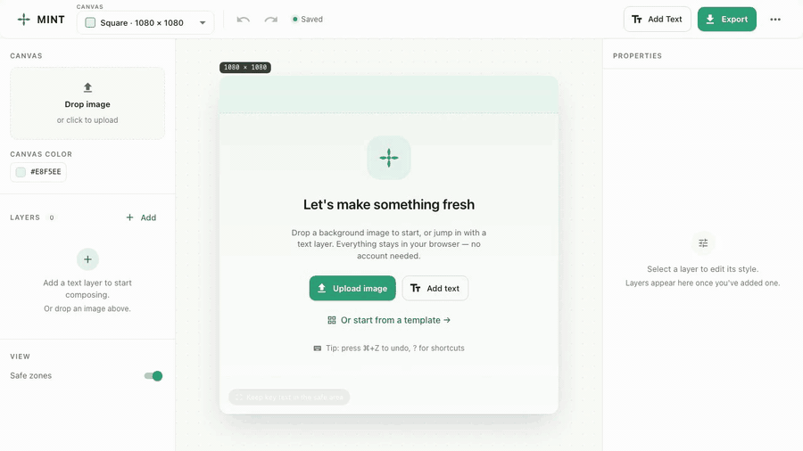
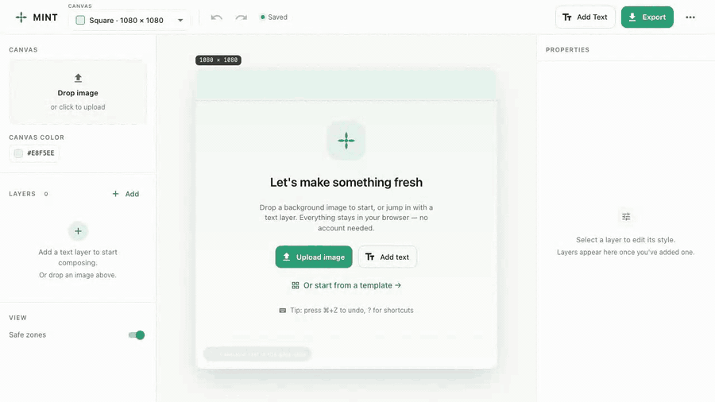
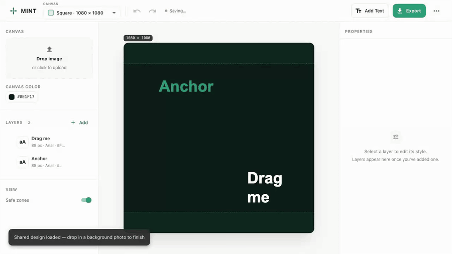
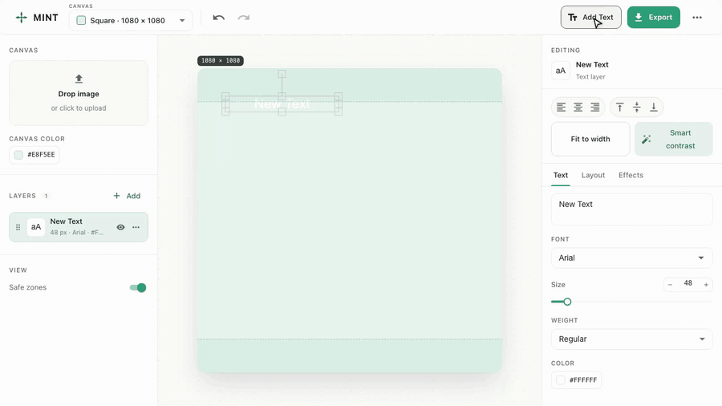
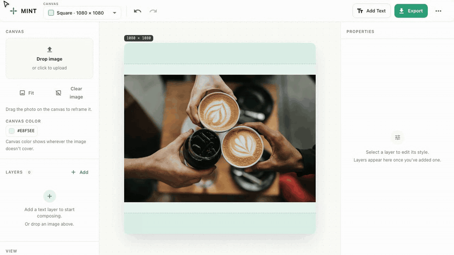
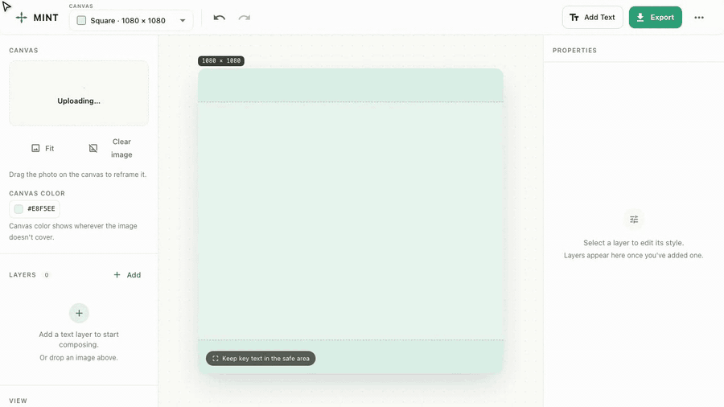
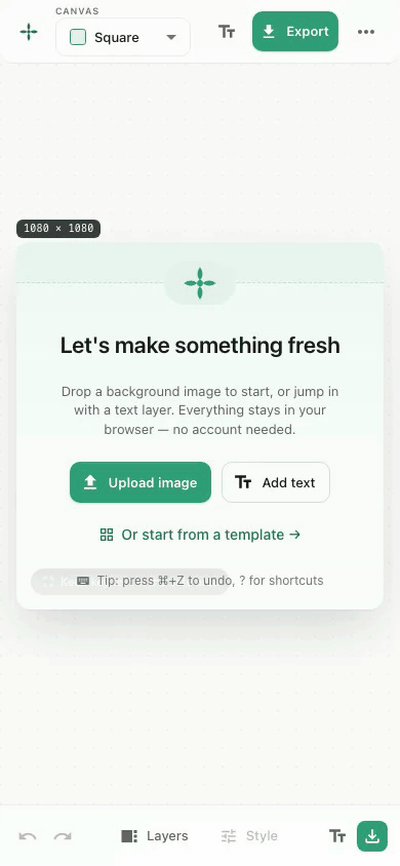

<p align="center">
  
</p>

<h1 align="center">MINT</h1>

<p align="center">
  <strong>Самый быстрый способ собрать пост-обложку — открыли страницу, бросили фото, вписали заголовок, нажали Экспорт.</strong><br/>
  Без регистрации. Без загрузок на чей-то сервер. Без водяного знака. Без «Apgrade to Pro».
</p>

<p align="center">
  <a href="https://dimagious.github.io/mint/">
    
  </a>
  &nbsp;
  <a href="https://github.com/Dimagious/mint/stargazers">
    
  </a>
</p>

<p align="center">
  <a href="https://github.com/Dimagious/mint/actions/workflows/ci.yml">
    
  </a>
  &nbsp;
  
  &nbsp;
  
  &nbsp;
  <a href="./LICENSE">
    
  </a>
  &nbsp;
  
</p>

<p align="center"><a href="./README.md">English</a> · [Русский]</p>

<p align="center">
  
</p>

---

## За 30 секунд

Вам нужна аккуратная обложка прямо сейчас. Любой «лёгкий аналог Canva» хочет email, синхронизирует ваш проект в облако, которое вы не просили, и прячет экспорт PNG за подпиской. **MINT всё это пропускает.**

Открыли страницу. Бросили фото. Написали заголовок. Smart Contrast одним кликом подбирает читаемый цвет, Fit-to-width подгоняет размер шрифта, направляющие держат вёрстку ровной. Экспорт в PNG, JPEG или WebP в точных размерах, которые публикуют Instagram, LinkedIn, TikTok и Pinterest.

Всё работает в браузере. Ваше фото не покидает устройство. Сервера просто нет.

> **MINT** = **M**erge **I**mage'**N** **T**ext.

## Почему его используют

- **Открыл и пошёл.** Никакого аккаунта, никакого email, никакого онбординга. Empty-state читается за 4 секунды.
- **Ваши файлы — ваши.** Фото читается локально и не уходит в сеть. Закрыли вкладку — в облаке его нет.
- **Точные размеры под каждую соцсеть.** Три пресета холста (Квадрат 1080, Портрет 1080×1350, Сторис 1080×1920) совпадают с тем, что реально публикует Instagram, LinkedIn, TikTok и Pinterest — никаких неловких обрезаний при загрузке.
- **Smart Contrast.** Один клик сэмплит фон под заголовком и подбирает читаемый цвет с дополняющей обводкой. Хватит воевать с белым на белом.
- **Snap к слоям, как в Figma.** Подтащили слой к краю или центру другого — он защёлкивается с мятной направляющей. Композиции остаются ровными без линеек.
- **`⌘K` для всего.** Командная палитра по fuzzy-поиску перекрывает каждое действие — добавить текст, сменить холст, переключить язык, включить safe-zones, скопировать share-ссылку. Опытным даёт скорость, новичкам — discoverability.
- **Делитесь через URL.** «Скопировать ссылку для шаринга» упаковывает композицию в `#mint=...` hash. Вставляете куда угодно — получатель открывает тот же дизайн (без вашего фото) у себя в браузере.
- **Настоящий мобильный редактор.** Не «адаптив» — реально удобен на телефоне. Нижний бар, drawer-ы Layers и Style, закрытие свайпом вниз.
- **Устанавливается и работает офлайн.** Добавьте на главный экран — MINT работает без сети. PWA с ручной регистрацией SW, чтобы дружить со строгим CSP.
- **English / Русский** в паритете, выбор языка живёт между сессиями.

## Смотрим в действии

> Все клипы — короткие беззвучные циклы, до 15 секунд каждый.

### 1. Бросил, вписал, выгрузил



### 2. Snap по краям слоёв



### 3. Командная палитра ⌘K



### 4. Поделиться через URL



### 5. Переместить фоновое фото



### 6. Мобильный



## Всё, что умеет

<details>
<summary><strong>Композиция</strong> — холст, фото, слои</summary>

- Три пресета холста: **Квадрат (1080)**, **Портрет (1080×1350)**, **Сторис (1080×1920)**.
- **14 готовых шаблонов** по категориям Анонс, Цитаты, Соцсети, Промо, Dev — один клик и стартовая композиция на холсте.
- **Drop или вставка** любого JPEG / PNG / WebP в качестве фона. Файлы остаются локально; до 15 MB с проверкой magic-byte.
- **Ручное обрамление** — таскайте фото на холсте, угловой хэндл даёт пропорциональный зум, **Сбросить положение** возвращает к auto-fit, **Crop ↔ Fit** переключает режим auto-fit.
- **Цвет холста** виден там, где фото не покрывает кадр — Fit-режим и прозрачные фоны выглядят аккуратно.

</details>

<details>
<summary><strong>Стиль текста</strong> — шрифты, цвет, эффекты</summary>

- Больше 30 Google Fonts, подгружаются по запросу. Ищите через fuzzy-поиск.
- Полный набор настроек типографики: **размер, насыщенность (100-900), цвет, прозрачность, выравнивание, межстрочный и межбуквенный интервалы**.
- На каждый слой — **тень**, **обводка**, **фоновая заливка** с отступом и скруглением.
- **Smart Contrast** — один клик подбирает читаемый цвет и обводку под фон.
- **Fit-to-width** — автоподгонка размера шрифта под ширину слоя без ручного перебора.

</details>

<details>
<summary><strong>Слои</strong></summary>

- **Drag-to-reorder** на `@dnd-kit` (клавиатурно доступно — Space подобрать, стрелки переместить).
- **Lock, hide, duplicate** для каждого слоя.
- **Copy / paste / delete** стандартными шорткатами.
- **Undo / redo** со смарт-коалесцингом — drag-then-zoom это одна запись в истории, а не 60.
- **Snap к краям и центрам слоёв** + центральные линии холста с живыми мятными направляющими.

</details>

<details>
<summary><strong>Экспорт и шеринг</strong></summary>

- **PNG, JPEG, WebP** в 1× или 2× с живым превью и оценкой размера файла.
- **Своё имя файла** перед скачиванием.
- **Safe-zone оверлеи** показывают, где Instagram и TikTok режут заголовок.
- **Shareable URL** — упакует композицию в hash, можно вставить куда угодно.
- **`.json` save / load** — полная переносимость проекта (вместе с фото, без сервера).

</details>

<details>
<summary><strong>Удобство</strong></summary>

- **Автосохранение** в `localStorage` с живым бейджем «Сохранено». Per-device opt-out.
- **Устанавливается как PWA** — на главный экран, открывается как нативное приложение, работает офлайн.
- **English / Русский** в полном паритете, язык живёт между сессиями.
- **Командная палитра (`⌘K`)** покрывает каждое действие — добавить текст, сменить пресет, поделиться ссылкой, переключить язык, включить safe-zones, автосохранение on/off.
- **Mobile-first drawer-ы** со свайпом-закрытием.

</details>

## Сделано под клавиатуру

| Действие                         | Шорткат                               |
| -------------------------------- | ------------------------------------- |
| Командная палитра                | `⌘K` / `Ctrl+K`                       |
| Добавить текстовый слой          | `T`                                   |
| Undo / redo                      | `⌘Z` / `⌘⇧Z` или `⌘Y`                 |
| Дублировать выбранный слой       | `⌘D`                                  |
| Copy / paste слоя                | `⌘C` / `⌘V`                           |
| Удалить выбранный слой           | `⌫` / `Delete`                        |
| Экспорт                          | `⌘E`                                  |
| Шаблоны                          | `⌘G`                                  |
| Снять выделение / закрыть диалог | `Esc`                                 |
| Сдвиг выбранного слоя            | `←↑→↓` (или `Shift+стрелки` на 10 px) |
| Шпаргалка по горячим клавишам    | `?`                                   |

## Ваши фото остаются на вашем устройстве

У MINT нет бэкенда. Нет очереди загрузок, нет синхронизации проектов, нет телеметрии. «Save project» — это `.json`, который вы держите у себя. Автосохранение пишется в `localStorage` на вашем устройстве, его можно выключить в overflow-меню одним кликом и одним же кликом стереть.

- **Нет tracking-пикселей** — страница грузит ровно то, что нужно для работы.
- **Строгий CSP** — никаких inline-скриптов. Service Worker регистрируется вручную, чтобы политика осталась чистой.
- **Шрифты Google не дёргаются заранее** — конкретный шрифт подгружается только когда вы его выбрали.
- **Ручная валидация ввода** — каждый загруженный проект (с диска или из share-ссылки) проходит bounds-проверки до того, как попасть на холст. См. [`document-validation.ts`](apps/web/src/utils/document-validation.ts).

## Установить как приложение

MINT — Progressive Web App. На десктопе подсказка установки появится в адресной строке; на мобильном — «Добавить на главный экран». После установки:

- Открывается в своём окне без браузерной обёртки.
- Работает **офлайн** — после первого открытия можно собирать картинки в самолёте.
- Обновляется в фоне; перезагрузка подтягивает новую версию.

---

## Для разработчиков

> Если пришли не за кодом — можно пропустить.

### Что я построил и чему научился

Несколько инженерных решений, на которые стоит посмотреть:

- **Canvas как состояние, а не как DOM.** [Fabric.js](https://fabricjs.com/) держит визуальное представление; [Zustand](https://github.com/pmndrs/zustand) — источник правды. Тонкий `FabricAdapter` транслирует мутации стора в операции над canvas, а selection / drag события — обратно в action'ы. Стор — единственный писатель, canvas — рендерер.
- **Command-pattern history с коалесцингом.** Каждая мутация — `Command` с `execute` / `undo`. Drag слайдера это 60 событий; история склеивает соседние апдейты от одного источника в одну запись, и `Cmd+Z` совпадает с интентом пользователя.
- **Чистая геометрия snap'а.** Smart guides ([`snap.ts`](packages/editor/src/adapter/snap.ts)) живут чистой функцией над прямоугольниками — адаптер вызывает её и рендерит результат. Математика юнит-тестируется без живого canvas.
- **Валидация в глубину.** Загружаемые проекты (с диска _или_ из `#mint=...` ссылки) проходят bounds-проверки — координаты, размер шрифта, префикс dataURL картинки, количество слоёв — так что хэнд-эдит payload не уронит canvas OOM-ом и не протащит `javascript:` URL.
- **Дизайн до кода.** В репо есть [`docs/design/BRIEF.md`](./docs/design/BRIEF.md) — настоящий бриф со скриншотами «до/после» и чеклистом приёмки. PR редизайна сверялся с брифом, а не с настроением исполнителя.
- **i18n со второго дня.** Доделывать русский в полированный UI потом было бы больно. `en.json` и `ru.json` идут паритетно, CI ловит расходящиеся ключи.

### Стек

<p>
  
  
  
  
  
  
  
  
  
  
  
  
</p>

### Архитектура

```text
apps/
  web/        React + Vite фронтенд (сам редактор)
  api/        опциональный backend-плейграунд — сейчас не используется
packages/
  core/       доменные типы, пресеты, фабрики, утилиты экспорта
  editor/     Zustand-стор, command history, Fabric.js-адаптер, snap-math
  ui/         переиспользуемые компоненты + MUI-тема + загрузчик Google Fonts
  utils/      маленькие общие хелперы (без DOM)
```

Дизайн-бриф, по которому делали текущий UI: [`docs/design/BRIEF.md`](./docs/design/BRIEF.md).

### Быстрый старт

```bash
pnpm install
pnpm dev
```

Откройте <http://localhost:3000>.

### Скрипты

```bash
pnpm dev          # запуск веб-приложения локально
pnpm build        # сборка всех пакетов
pnpm test         # unit-тесты (Vitest)
pnpm test:e2e     # Playwright end-to-end
pnpm lint         # eslint по всему монорепо
pnpm format:check # проверка Prettier
```

### CI / деплой

`push` в `main` триггерит [`ci.yml`](./.github/workflows/ci.yml) (lint, format, build, unit, e2e) и [`deploy-pages.yml`](./.github/workflows/deploy-pages.yml) (GitHub Pages из `apps/web/dist`). В Settings → Pages источник должен быть **GitHub Actions**.

### Контрибьют

Баг-репорты, фидбек и PR-ы приветствуются — см. [`CONTRIBUTING.md`](./CONTRIBUTING.md). Хорошие точки входа: новые шаблоны, ещё Google Fonts, RTL.

---

## Звезда, шеринг, поддержка

Если MINT сэкономил вам час, который ушёл бы на воевание с Canva:

- [Поставьте звезду этому репо](https://github.com/Dimagious/mint) — это ничего не стоит и помогает другим его найти.
- [Угостите кофе](https://buymeacoffee.com/dimagious) — ценю, но не ожидаю.
- Открывайте issues со скриншотами — мелкие UI-нитки делают продукт лучше.

## Лицензия

[MIT](./LICENSE) — форкайте, выпускайте производное, используйте в клиентских работах. Не выдавайте за чью-то другую «AI-дизайн платформу».
